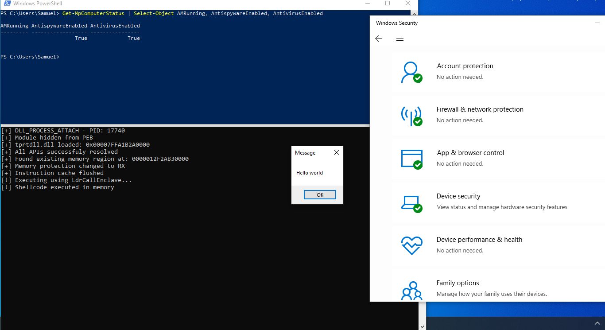

  <em>« La force se cache dans l’invisible, et l’invisible gouverne tout. »</em>

  

# KittyLoader

> [!CAUTION]
> **Disclaimer & Legal Notice**  
> This repository, **KittyLoader**, and all associated code, techniques, and information are provided strictly for **educational and academic research purposes**.  
>
> This sample and its methodologies have been **proactively disclosed to relevant cybersecurity defense organizations and vendors**. It is actively used by defensive engineers to research attack patterns, develop detection capabilities, and enhance security products.  
>
> You are required to use this knowledge and these tools **only on systems you own or have explicit, written permission to test**.  
> Any unauthorized use against systems you do not own is **illegal and strictly prohibited**.  
>
> This tool was created to advance the field of defensive cybersecurity. The author, *tlsbollei*, assumes **no liability** and is not responsible for any misuse or damage caused by this software.  
>
> By accessing this repository, you acknowledge that you understand its purpose is to learn about **modern malware techniques, evasion tactics**, and ultimately to **improve our collective ability to defend against them**.

By proceeding, you agree to use this information responsibly and legally.

### About> 
> [!NOTE]
> Yes, I am aware of all of the compilation hazards. Kitty was released as a source PoC, but due to recent complaints, Kitty will be soon uploaded operationalized.

KittyLoader is a highly evasive loader written in C / Assembly.

### Features
- Hijacks early execution by replacing the C runtime entrypoint (__scrt_common_main_seh) with custom assembly.
  
- Hides all modules by walking PEB->Ldr lists and unlinking its module entry (LDR_DATA_TABLE_ENTRY) from :
    - InLoadOrderModuleList
    - InInitializationOrderModuleList
    - InMemoryOrderModuleList
      
- Deploys a wide variety of anti-analysis techniques, including :
    - Multilayer scoring (debugger, sandbox/resources, API integrity/hook checks, human-input entropy, contextual cues like domain/time of day) combined into a weighted overall confidence that continuously re-evaluates
    - Picks an operational state (full → halted) and throttles/pauses with jittered, CPU-cycle-based delays in a loop that keeps reassessing the environment.
    - API integrity/inline-hook heuristics and light tamper probes; human-interaction entropy sampling; randomized yet precise timing jitter to throw off debuggers
    - Adds controlled noise (junk calcs + jittered delays) and spreads logic across multiple signals, reducing single-indicator detection.
  
- Embedded payload is encrypted at rest, with key and nonce derived at runtime from entropy sources: PID, TID, QPC, memory load, CPU info (CPUID), tick count.
- Preferred algo is ChaCha20, but in case of failure falls back to RC4, decryption occurs in place after the encrypted blob is copied into memory.
- APIs are initially attempted to be resolved via tprtdll.dll, which is quite the modern technique, it does so using GetModuleHandleW(L"tprtdll.dll") with DONT_RESOLVE_DLL_REFERENCES to minimize operation footprint.
- Uses high-entropy randomness (PID/TID/GetTickCount/__rdtsc and more) to vary scan starts, delays, and sizes—reducing deterministic patterns and signature matches to cripple static.
  
- Searches for (RX/RWX/RW, non-guarded) and guards behind additional is_region_safe() heuristic, and does the following :
    - Resolves sensitive APIs via stealthy, hash-based lookups instead of plain export walking—shrinks observable footprints and evades basic hooks
    - Loads libraries with quiet flags (DONT_RESOLVE_DLL_REFERENCES, LOAD_LIBRARY_SEARCH_SYSTEM32) which minimizes I/O usage and loader footprint

- Writes and decrypts payload in scattered, variably sized chunks with micro-jitter—disrupts linear memory-write/decrypt heuristics and timing correlations
    - Performs staged protection flips (RW → RWX → RX) and later restores RW before wipe/free—mimics legitimate behavior and lowers post-execution forensics   

- Execute via LdrCallEnclave, normally intended for SGX/VBS enclaves, instead of jumping to a secure enclave, we jump to an arbitrary function pointer in normal (VTL0) user memory - latest version adds timing camouflage and a plausible execution context

- Cleans up carefully (I-cache flush, SecureZeroMemory, free) with randomized post-execution timing—limits residue and timeline clustering

> [!NOTE]
> To fix in the future -  ChaCha20 implementation bug, entry hijack ASM prologue/epilogue issues, control flow and compile hazards, and silence anti analysis more. Add fallbacks if LdrCallEnclave fails, and implement more stable key derivation. Or just fix it yourself!

### Credits:
- [@whokilleddb](https://x.com/whokilleddb): [Run shellcode using LdrCallEnclave](https://gist.github.com/whokilleddb/ef1f8c33947f6ceb90664ce38d3dcf04)
- [@whokilleddb](https://x.com/whokilleddb): [tprtdll.dll (like so many others) exposes some Nt/Rtl/Zw functions, without redirecting to the ntdll.dll!](https://github.com/whokilleddb/function-collections/blob/main/winapi_alternatives/NtAllocateMemoryEx/main.c)
